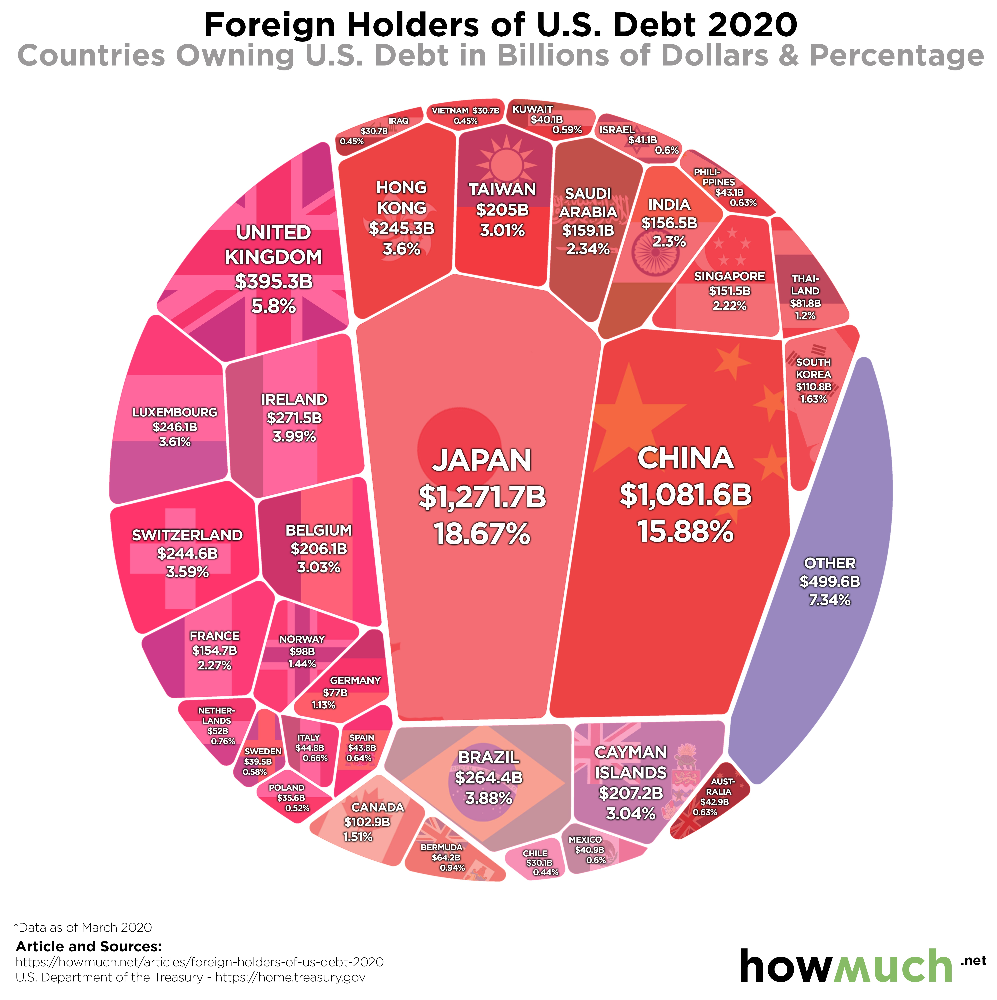

```{r setup, include=FALSE}
# Do not change these settings!
knitr::opts_chunk$set(warning = FALSE, message = FALSE)
```

### {.tabset} 


Click the **Original**, **Code** and **Reconstruction** tabs to read about the issues and how they were fixed. 

#### Original

<br>
<center>

</center>
<center>*Source:https://howmuch.net/articles/foreign-holders-of-us-debt-2020.*</center>
<br>

**Objective**

The objective of the visualisation was to showcase which countries actually own the most U.S. debt and how big those debts are in a single plot. 

Knowing the country’s debt is important. The majority of countries have defaulted at least once in their lifetime. Governments tend to default for a variety of different reasons and its implications are ranging from a simple reversal of global capital flows to weak revenues to currency devaluation. For instance, as a country's debt-to-GDP ratio rises, it often signals that a recession is underway. Sometimes implications can also be far stretched. For instance, if a country devalues its currency to pay its debt, the lower currency valuation makes their products cheaper for export and helps its manufacturing industry. However, this visualisation is not about predicting sovereign defaults as it is extremely difficult, but more of an important measure to monitor to understand the macroeconomic landscape, and to assess potential challenges and opportunities. 

So, the intended target audience for this visualization would be market analysts, financial specialists, rating agencies, retail and institutional investors, traders, government authorities, and policymakers.
 

The visualisation had the following three main issues:

Inability to amplify cognition:

* The visualisation is missing familiar representation object; sizes are shapes are unusual, no proper frame of reference to compare areas of the different countries. By looking at the visualisation, audience will not get a good sense about the debt measure. 
* For instance, it is difficult to quickly draw a comparison between Saudi Arabia and Hong Kong without looking at their numeric values. Visually they appear to be of same sizes but actual values differ considerably.
* This visualisation will demand a lot of time and effort from the audience and will be more painful for the audience who would look for a relative ranking of a country. Finally they are like to resort to looking and remembering the numeric debt measures.

Not helping in communicating the key data insight (the “so what” question):

* Using the absolute debt figure is not as representative as using a measure that compares the debt to the size of the country’s economy. Debt as a percentage of gross domestic product is a useful measure for the audience allowing them to gauge a country's ability to pay off its debt by comparing what a country owes with what it produces. Without considering the country’s ability to pay, the absolute debt figure might give a misleading picture.
* For instance, from the visualisation, Japan and China are the most indebted countries to the USA, portraying a risky profile. However, their Debt to GDP ratios are the lowest, indicating low risk of default. 
* So, debt measure in isolation may create poor quality insights or even unintentionally mislead the audience, which is not in line with the ethical principle of ‘beneficence’.

Irrelevant use of colour coding:

* The visualisation grouped countries from the same continent and coded them with the same colour. For the audience, it is hardly of any significance to know which continent owns most the debt. The objective is to get country-specific insight. Moreover, the colour shades of the different continents are so similar that it will add to the confusion.
* For instance, Asian countries like Taiwan, Singapore and Japan are colour coded in red. If we compare these with colour coding of Canada and Bermuda, visually there is hardly any difference.
* Colour is one of the most important features of visualisation and we must make effective use that contributes to communicating key data insight.

**Reference**

* Charted: The Biggest Foreign Holders of U.S. Debt. Published online at Howmuch.net. Retrieved on September 08, 2020, via website <https://howmuch.net/articles/foreign-holders-of-us-debt-2020> [Online Resource]

#### Code

For reconstruction, I have used the updated debt data from the original source U.S. Department of the Treasury [1]. 
I have integrated additional GDP data to calculate US Debt to GDP ratio; I have retrieved 2020 GDP data from the International Monetary Fund[2].

The following code was used to fix the issues identified in the original. 

```{r}
library(ggplot2)
library(tidyr)
library(dplyr)
library(readxl)


debt_data<- read_excel("Debt_data.xlsx")
gdp_data <- read_excel("GDP_Data.xlsx")
gdp_data$GDP <- as.numeric(gdp_data$GDP)


#joining debt_data and gdp_data using the country name
debt_gdp_data <- debt_data %>% left_join(gdp_data, by = "Country")

debt_gdp_data $Debt_June_2020 <- as.numeric(debt_gdp_data $Debt_June_2020)


#Creating a new variable debt to gdp ratio by diving debt to country's GDP.
debt_gdp_data <- debt_gdp_data %>% mutate(debt_gdp = (Debt_June_2020/GDP))


#Creating debt to gdp ratio categories of <20%, 20% to <40%, 40% to <60%, 60% to <80%, 80%+
debt_gdp_data <- debt_gdp_data %>% 
  mutate(debt_gdp_ratio = 
           cut(debt_gdp, breaks=c(0,0.2,0.4,0.6,0.8,50), 
               labels=c("<20%","20% to <40%", "40% to <60%", "60% to <80%", "80%+")))

#Rounding debt values
debt_gdp_data$Debt_June_2020 <- round(debt_gdp_data$Debt_June_2020)


#Plotting the data
Debt_plot <-ggplot(data = debt_gdp_data, 
                   mapping = aes(x = reorder(Country, Debt_June_2020), 
                                 y = Debt_June_2020)) +  theme_bw()  + 
#plot type
geom_bar(stat = "identity", aes(fill = debt_gdp_ratio), position = "dodge",width=0.8) + 
  
#Selecting colours which are slightly meaningful and freindly to people with colourblindness
scale_fill_manual(values = c("darkseagreen3", "skyblue1", "cyan3", "burlywood1", "tomato2"),
                na.value = "grey50")+
  
geom_text(aes(label=Debt_June_2020), hjust="left", color="Black", size=3.2) +
coord_flip() + 
  
#customising the non-data components of the plot; i.e. theme
theme(panel.border = element_blank(), 
      strip.text.y = element_text(angle = 180,size=10,face = 'bold'),
      axis.text.x=element_text(size = 9.5),
      axis.text.y=element_text(size = 9.5)) + 
  
#customising the legent theme
theme(
  legend.title = element_text(size = 10, face = "bold"),
  legend.position="right",
  legend.key.height = unit(0.6, "cm"),
  legend.key.width = unit(0.6, "cm"),
  legend.direction="vertical")+
  
  
#customising Labels 
xlab("Country") + 
ylab("Debt in USD Billion") + 
guides(fill=guide_legend(title="Debt(US) to GDP Ratio"))+
  

labs(title = "Foreign Holders of U.S. Debt 2020", subtitle = "Countries Owning U.S. Debt in Billions of Dollars and their Debt(US) to GDP Ratio", 
caption = "*Data as of June 2020
Article and Sources: 
https://howmuch.net/articles/foreign-holders-of-us-debt-2020
U.S. Department of the Treasury - https://home.treasury.gov/
IMF - https://www.imf.org/external/pubs/ft/weo/2020/01/weodata/index.aspx") +

#Moving caption to the left and making title bold
theme(plot.caption = element_text(hjust = 0), plot.title = element_text(face = "bold"))

```

**Data Reference**

* [1]U.S. Department of the Treasury. Major Foreign Holders of Treasury Securities. Data retrieved on September 08, 2020, via website <https://ticdata.treasury.gov/Publish/mfh.txt>

* [2]International Monetary Fund. 2020. World Economic Outlook Database, April 2020. Custom data retrieved on September 08, 2020, via website <https://www.imf.org/external/pubs/ft/weo/2020/01/weodata/weoselco.aspx?g=2001&sg=All+countries>

#### Reconstruction

The following plot fixes the main issues in the original.

```{r fig.align="center", fig.height = 7, fig.width = 11.5, echo = FALSE}
Debt_plot
```

